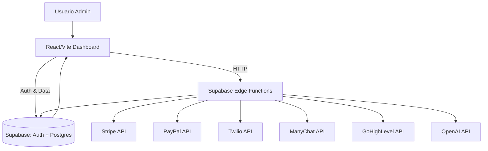

# Manual técnico y operativo — Revenue Command Center

> **Nota sobre ZIP:** No se encontró ningún archivo `.zip` en el repositorio actual, por lo que no fue posible “descomprimir” nada. Si existe un ZIP fuera del repo, proporciónalo o indícanos la ruta exacta para incorporarlo. (Evidencia: `./` sin archivos `.zip`, comando `find . -maxdepth 2 -name "*.zip" -print`)

---

## 1. Resumen Ejecutivo

**Qué es la app**
Este repositorio contiene una aplicación web tipo **dashboard administrativo** para operaciones de ingresos (Revenue Ops), con autenticación basada en **Supabase** y funciones serverless (Supabase Edge Functions) para sincronizar datos con Stripe/PayPal, recibir leads, y ejecutar campañas por SMS/WhatsApp/ManyChat. El frontend está construido con **Vite + React + TypeScript + Tailwind + shadcn/ui** y usa **React Query** para el acceso a datos. (Evidencia: `package.json`, `vite.config.ts`, `src/App.tsx`, `src/integrations/supabase/client.ts`)

**Caso de uso principal**
Centralizar métricas y operaciones de ingresos: clientes, transacciones, facturación, recuperación de ingresos, campañas y sincronización con sistemas externos (Stripe, PayPal, ManyChat, GoHighLevel, Twilio). (Evidencia: `src/pages/Index.tsx`, `src/components/dashboard/*`, `supabase/functions/*`)

**Tecnologías detectadas**

| Capa | Tecnología | Evidencia |
|---|---|---|
| Frontend | React 18 + Vite + TypeScript | `package.json`, `vite.config.ts` |
| UI | Tailwind CSS + shadcn/ui + Radix UI | `tailwind.config.ts`, `src/components/ui/*`, `package.json` |
| Estado/Fetch | React Query | `src/App.tsx` |
| Auth/Backend | Supabase (Auth + DB + Edge Functions) | `src/integrations/supabase/client.ts`, `supabase/config.toml` |
| PWA | vite-plugin-pwa | `vite.config.ts` |
| Móvil | Capacitor | `package.json`, `capacitor.config.ts` |

**Evidencia:** `package.json`, `vite.config.ts`, `tailwind.config.ts`, `src/App.tsx`, `src/integrations/supabase/client.ts`, `capacitor.config.ts`.

---

## 2. Cómo Ejecutarla (Guía Rápida)

### Requisitos
- **Node.js + npm** (no se especifica versión exacta en el repo; recomendado usar LTS). (Evidencia: `README.md`, `package.json`)

### Comandos principales
- Instalar dependencias: `npm install`
- Dev server: `npm run dev`
- Build: `npm run build` o `npm run build:dev`
- Preview: `npm run preview`
- Lint: `npm run lint`
- Tests: `npm run test`

(Evidencia: `package.json` scripts)

### Variables de entorno

> **Nota:** Solo se listan variables encontradas en el código. Si falta alguna, aparece como “No encontrado en el repositorio”.

| VAR | Descripción | Dónde se usa | Ejemplo/Default |
|---|---|---|---|
| `VITE_SUPABASE_URL` | URL del proyecto Supabase | `src/integrations/supabase/client.ts`, `src/components/dashboard/WebhookConfigPanel.tsx` | `https://<project>.supabase.co` |
| `VITE_SUPABASE_PUBLISHABLE_KEY` | API key pública (anon) de Supabase | `src/integrations/supabase/client.ts` | `eyJ...` |
| `SUPABASE_URL` | URL para Edge Functions | `supabase/functions/*` | `https://<project>.supabase.co` |
| `SUPABASE_ANON_KEY` | Key pública para accesos anon | `supabase/functions/*` | `eyJ...` |
| `SUPABASE_SERVICE_ROLE_KEY` | Service role para operaciones admin | `supabase/functions/*` | `eyJ...` |
| `ADMIN_API_KEY` | Header X-ADMIN-KEY para webhooks y endpoints internos | `supabase/functions/receive-lead`, `supabase/functions/unify-identity`, `supabase/functions/*` | `secret-string` |
| `STRIPE_SECRET_KEY` | API key privada de Stripe | `supabase/functions/stripe-webhook`, `fetch-*` | `sk_live_...` |
| `STRIPE_WEBHOOK_SECRET` | Secreto de firma de webhook | `supabase/functions/stripe-webhook` | `whsec_...` |
| `PAYPAL_CLIENT_ID` | Client ID PayPal | `supabase/functions/fetch-paypal*`, `paypal-webhook` | `...` |
| `PAYPAL_SECRET` | Secret PayPal | `supabase/functions/fetch-paypal`, `paypal-webhook` | `...` |
| `PAYPAL_CLIENT_SECRET` | Secret alterno PayPal | `supabase/functions/fetch-paypal-products`, `fetch-paypal-subscriptions` | `...` |
| `PAYPAL_WEBHOOK_ID` | Webhook ID PayPal | `supabase/functions/paypal-webhook` | `...` |
| `TWILIO_ACCOUNT_SID` | SID de Twilio | `supabase/functions/send-sms`, `send-campaign`, `twilio-inbound`, `twilio-templates` | `AC...` |
| `TWILIO_AUTH_TOKEN` | Token Twilio | `supabase/functions/send-sms`, `send-campaign`, `twilio-templates` | `...` |
| `TWILIO_PHONE_NUMBER` | Número Twilio (SMS) | `supabase/functions/send-sms`, `send-campaign` | `+1...` |
| `TWILIO_WHATSAPP_NUMBER` | Número Twilio WhatsApp | `supabase/functions/send-sms` | `whatsapp:+1...` |
| `MANYCHAT_API_KEY` | API key de ManyChat | `supabase/functions/send-manychat`, `send-campaign`, `sync-manychat` | `...` |
| `GHL_API_KEY` | API key GoHighLevel | `supabase/functions/sync-ghl`, `notify-ghl`, `ghl-templates` | `...` |
| `GHL_LOCATION_ID` | Location ID de GHL | `supabase/functions/sync-ghl`, `notify-ghl`, `ghl-templates` | `...` |
| `OPENAI_API_KEY` | API key OpenAI | `supabase/functions/analyze-business` | `sk-...` |
| `LOVABLE_API_KEY` | API key de Lovable | `supabase/functions/generate-chat-summary` | `...` |

(Evidencia: `src/integrations/supabase/client.ts`, `src/components/dashboard/WebhookConfigPanel.tsx`, `supabase/functions/*`)

---

## 3. Mapa del Repositorio

### Árbol de directorios (hasta 3 niveles)
```
.
├── docs
├── public
├── src
│   ├── components
│   ├── hooks
│   ├── integrations
│   ├── lib
│   ├── pages
│   ├── test
│   └── types
└── supabase
    ├── functions
    └── migrations
```
(Evidencia: salida de `find . -maxdepth 3 -type d | sort`)

### Carpetas clave
| Carpeta | Propósito | Archivos clave |
|---|---|---|
| `src/pages` | Rutas principales de la app | `Index.tsx`, `Login.tsx`, `Install.tsx` |
| `src/components/dashboard` | Módulos del dashboard | `DashboardHome.tsx`, `ClientsPage.tsx`, `InvoicesPage.tsx`, `CampaignControlCenter.tsx` |
| `src/integrations/supabase` | Cliente Supabase y tipos | `client.ts`, `types.ts` |
| `supabase/functions` | Backend serverless (Edge Functions) | `stripe-webhook`, `receive-lead`, `sync-ghl`, etc. |
| `supabase/migrations` | Migraciones DB | `*.sql` |

(Evidencia: `src/**`, `supabase/**`)

---

## 4. Arquitectura de Alto Nivel

### Diagrama de componentes (Mermaid)


### Componentes y responsabilidades
- **Frontend (Vite + React):** UI del dashboard, autenticación y consumo de datos con React Query. (Evidencia: `src/App.tsx`, `src/pages/*`)
- **Supabase Auth/DB:** gestión de usuarios, sesiones y persistencia de datos (clientes, transacciones, campañas, etc.). (Evidencia: `src/integrations/supabase/client.ts`, `src/integrations/supabase/types.ts`)
- **Supabase Edge Functions:** integraciones con Stripe/PayPal/Twilio/ManyChat/GHL y webhooks. (Evidencia: `supabase/functions/*`, `supabase/config.toml`)

**Evidencia:** `src/App.tsx`, `src/pages/*`, `src/integrations/supabase/client.ts`, `supabase/config.toml`, `supabase/functions/*`.

---

## 5. Frontend (si existe)

### Framework y build
- **Framework:** React 18 + Vite. (Evidencia: `package.json`, `vite.config.ts`)
- **PWA:** Configurado con `vite-plugin-pwa`. (Evidencia: `vite.config.ts`)
- **UI:** shadcn/ui con Radix UI + Tailwind. (Evidencia: `src/components/ui/*`, `tailwind.config.ts`)

### Ruteo/páginas
- Rutas principales: `/` (dashboard), `/login`, `/install`, fallback `*`. (Evidencia: `src/App.tsx`)

### Estado y data fetching
- React Query para queries y mutations. (Evidencia: `src/App.tsx`)

### Principales pantallas y flujos
- **Dashboard** con módulos para clientes, facturas, campañas, sync y analytics. (Evidencia: `src/pages/Index.tsx`, `src/components/dashboard/*`)
- **Login** con validación y restricción de email admin. (Evidencia: `src/pages/Login.tsx`)

**Evidencia:** `src/App.tsx`, `src/pages/Index.tsx`, `src/pages/Login.tsx`, `src/components/dashboard/*`.

---

## 6. Backend/API (si existe)

### Framework
- **Supabase Edge Functions** (Deno). (Evidencia: `supabase/functions/*`, `supabase/config.toml`)

### Endpoints relevantes (Edge Functions)
> Ruta base Supabase: `https://<project>.supabase.co/functions/v1/<function>`

| Método | Ruta | Auth | Request | Response | Archivo |
|---|---|---|---|---|---|
| POST | `/receive-lead` | X-ADMIN-KEY | JSON lead | JSON status | `supabase/functions/receive-lead/index.ts` |
| POST | `/stripe-webhook` | Stripe signature | Webhook Stripe | JSON status | `supabase/functions/stripe-webhook/index.ts` |
| POST | `/paypal-webhook` | PayPal signature | Webhook PayPal | JSON status | `supabase/functions/paypal-webhook/index.ts` |
| POST | `/twilio-inbound` | Twilio SID check | Inbound webhook | JSON status | `supabase/functions/twilio-inbound/index.ts` |
| POST | `/send-sms` | JWT/X-ADMIN-KEY | SMS/WhatsApp | JSON status | `supabase/functions/send-sms/index.ts` |
| POST | `/send-campaign` | Service role | Execute campaign | JSON status | `supabase/functions/send-campaign/index.ts` |
| POST | `/sync-ghl` | Service role | Sync GHL | JSON status | `supabase/functions/sync-ghl/index.ts` |
| POST | `/sync-command-center` | Service role | Sync Stripe/PayPal | JSON status | `supabase/functions/sync-command-center/index.ts` |

**Evidencia:** `supabase/config.toml`, `supabase/functions/*`.

### Autenticación/autorización
- **Frontend:** usa Supabase Auth (session persistida) y rutas protegidas. (Evidencia: `src/App.tsx`, `src/hooks/useAuth.ts`)
- **Edge Functions:** `verify_jwt = false` en config, con validación interna (JWT + `is_admin()` o `X-ADMIN-KEY`). (Evidencia: `supabase/config.toml`, `supabase/functions/unify-identity/index.ts`)

### Lógica de negocio principal
- **Sync de pagos/ingresos:** funciones `fetch-stripe`, `fetch-paypal`, `sync-command-center` consultan y persisten transacciones, disputas, suscripciones, etc. (Evidencia: `supabase/functions/fetch-stripe/index.ts`, `supabase/functions/fetch-paypal/index.ts`, `supabase/functions/sync-command-center/index.ts`)
- **Recepción de leads:** `receive-lead` normaliza datos, deduplica y almacena clientes. (Evidencia: `supabase/functions/receive-lead/index.ts`)
- **Campañas y SMS:** `send-sms`/`send-campaign` integran Twilio/ManyChat. (Evidencia: `supabase/functions/send-sms/index.ts`, `supabase/functions/send-campaign/index.ts`)

**Evidencia:** `supabase/functions/*`.

---

## 7. Base de Datos y Persistencia

### Motor
- **Postgres (Supabase)**. (Evidencia: `src/integrations/supabase/types.ts`)

### Tablas principales (resumen)
- `clients`: clientes y datos de contacto. (Evidencia: `src/integrations/supabase/types.ts`)
- `transactions`: pagos y transacciones. (Evidencia: `src/integrations/supabase/types.ts`)
- `subscriptions`: suscripciones. (Evidencia: `src/integrations/supabase/types.ts`)
- `campaigns`, `campaign_rules`, `campaign_recipients`, `campaign_executions`. (Evidencia: `src/integrations/supabase/types.ts`)
- `webhook_events`: idempotencia de webhooks. (Evidencia: `supabase/functions/stripe-webhook/index.ts`, `src/integrations/supabase/types.ts`)

### Migraciones/seeders
- Migraciones SQL en `supabase/migrations/*.sql`. (Evidencia: `supabase/migrations/*`)

**Evidencia:** `src/integrations/supabase/types.ts`, `supabase/migrations/*`.

---

## 8. Procesos Asíncronos / Jobs / Colas

- **No se encontró** un sistema de colas dedicado (Rabbit/Redis). Sin embargo, hay **funciones de sincronización** que se pueden ejecutar manualmente o desde triggers externos. (Evidencia: `supabase/functions/sync-*`)
- **Webhooks** actúan como disparadores asíncronos (Stripe, PayPal, Twilio). (Evidencia: `supabase/functions/stripe-webhook/index.ts`, `supabase/functions/paypal-webhook/index.ts`, `supabase/functions/twilio-inbound/index.ts`)

**Evidencia:** `supabase/functions/*`.

---

## 9. Infraestructura y Despliegue

- **Docker/K8s/Terraform/Ansible:** No encontrado en el repositorio. (Evidencia: ausencia de `Dockerfile`, `docker-compose`, `*.tf`, `k8s/*`)
- **Supabase** gestiona infraestructura backend (DB + Edge Functions). (Evidencia: `supabase/config.toml`)
- **PWA** configurado para despliegue en hosting estático. (Evidencia: `vite.config.ts`)

**Evidencia:** `supabase/config.toml`, `vite.config.ts`.

---

## 10. CI/CD

- **No se encontraron** pipelines en `.github/workflows`, `.gitlab-ci.yml`, `Jenkinsfile`, etc. (Evidencia: ausencia de directorios/archivos CI)

**Evidencia:** no existe `.github/workflows` ni archivos CI en raíz.

---

## 11. Observabilidad

- **Logs:** Las Edge Functions registran eventos con `console.log/error`. (Evidencia: `supabase/functions/stripe-webhook/index.ts`, `supabase/functions/sync-ghl/index.ts`)
- **Healthchecks:** No encontrados. (Evidencia: no hay rutas específicas en frontend ni funciones dedicadas)

**Evidencia:** `supabase/functions/*`.

---

## 12. Seguridad (Checklist + Hallazgos)

### Hallazgos
1. **`verify_jwt = false` en múltiples Edge Functions**, incluyendo webhooks externos e internas. Aunque hay validaciones manuales en código, se debe revisar consistentemente. (Evidencia: `supabase/config.toml`, `supabase/functions/unify-identity/index.ts`)
2. **CORS abierto (`Access-Control-Allow-Origin: *`)** en algunos endpoints webhook. (Evidencia: `supabase/functions/receive-lead/index.ts`, `supabase/functions/stripe-webhook/index.ts`)
3. **Email admin hardcodeado** en el login. (Evidencia: `src/pages/Login.tsx`)
4. **Dependencia de headers secretos** (X-ADMIN-KEY) para endpoints críticos. Riesgo si se filtra. (Evidencia: `src/components/dashboard/WebhookConfigPanel.tsx`, `supabase/functions/receive-lead/index.ts`)

### Recomendaciones
- Revisar el uso de `verify_jwt` y reforzar con políticas de Row Level Security (RLS) y políticas por función.
- Limitar CORS a dominios autorizados.
- Mover la restricción de admin a roles en Supabase (`app_admins`) en lugar de hardcodear email.
- Rotar secretos periódicamente y usar vaults/secret managers.

**Evidencia:** `supabase/config.toml`, `supabase/functions/receive-lead/index.ts`, `src/pages/Login.tsx`, `src/components/dashboard/WebhookConfigPanel.tsx`.

---

## 13. Mantenimiento y Extensión

- **Puntos de entrada:** `src/main.tsx` y `src/App.tsx`. (Evidencia: `src/main.tsx`, `src/App.tsx`)
- **Dónde agregar features:** nuevas páginas en `src/pages/` y módulos en `src/components/dashboard/`. (Evidencia: `src/pages/*`, `src/components/dashboard/*`)
- **Convenciones:** uso de alias `@` para `src/`. (Evidencia: `vite.config.ts`, `tsconfig.json`)
- **Gotchas:** hardcode de admin email en login; validar configuración de envs para funciones. (Evidencia: `src/pages/Login.tsx`, `supabase/functions/*`)

**Evidencia:** `src/main.tsx`, `src/App.tsx`, `vite.config.ts`, `tsconfig.json`, `src/pages/Login.tsx`.

---

## 14. Anexos

### Archivos más importantes (top 30)
1. `package.json` — scripts y dependencias
2. `vite.config.ts` — build y PWA
3. `src/main.tsx` — entrypoint
4. `src/App.tsx` — rutas y providers
5. `src/pages/Index.tsx` — dashboard principal
6. `src/pages/Login.tsx` — login
7. `src/integrations/supabase/client.ts` — cliente Supabase
8. `src/integrations/supabase/types.ts` — esquema DB
9. `supabase/config.toml` — config de funciones
10. `supabase/functions/stripe-webhook/index.ts` — webhook Stripe
11. `supabase/functions/paypal-webhook/index.ts` — webhook PayPal
12. `supabase/functions/receive-lead/index.ts` — ingestión de leads
13. `supabase/functions/sync-command-center/index.ts` — sync central
14. `supabase/functions/sync-ghl/index.ts` — sync GHL
15. `supabase/functions/send-sms/index.ts` — SMS/WhatsApp
16. `supabase/functions/send-campaign/index.ts` — campañas
17. `supabase/functions/send-manychat/index.ts` — ManyChat
18. `supabase/functions/fetch-stripe/index.ts` — Stripe data
19. `supabase/functions/fetch-paypal/index.ts` — PayPal data
20. `supabase/functions/fetch-subscriptions/index.ts`
21. `supabase/functions/fetch-invoices/index.ts`
22. `supabase/functions/fetch-disputes/index.ts`
23. `supabase/functions/fetch-balance/index.ts`
24. `supabase/functions/recover-revenue/index.ts`
25. `supabase/functions/create-portal-session/index.ts`
26. `supabase/functions/generate-chat-summary/index.ts`
27. `supabase/functions/analyze-business/index.ts`
28. `src/components/dashboard/WebhookConfigPanel.tsx`
29. `src/components/dashboard/AnalyticsPanel.tsx`
30. `src/components/dashboard/RevenueOpsPipeline.tsx`

(Evidencia: listado de archivos en `src/` y `supabase/functions/`)

### Glosario
- **Supabase:** Backend-as-a-service con Auth, DB Postgres y Edge Functions.
- **Edge Function:** función serverless ejecutada en Deno.
- **RLS:** Row Level Security en Postgres.
- **PWA:** Progressive Web App.
- **GHL:** GoHighLevel.
- **ManyChat:** plataforma de mensajería/automatización.
- **MRR/LTV:** métricas de ingresos recurrentes.

(Evidencia: términos usados en `src/components/dashboard/*` y `supabase/functions/*`)

---

## Autoauditoría (Checklist)
- [x] ¿Se descomprimió y se listó el árbol de directorios? (No se encontró ZIP; árbol listado).
- [x] ¿Identifiqué stack completo (frontend/backend/BD/infra/CI)?
- [x] ¿Incluí comandos reales de ejecución/build/test?
- [x] ¿Tabla de variables de entorno con dónde se usan?
- [x] ¿Tabla de endpoints con archivos origen?
- [x] ¿Infra documentada (Docker/K8s/Terraform/etc.) si existe?
- [x] ¿Nada inventado sin evidencia? (marcado como “No encontrado” cuando aplica)
- [x] ¿Incluí diagramas Mermaid donde aporta claridad?
- [x] ¿Hallazgos de seguridad sin instrucciones de explotación?
